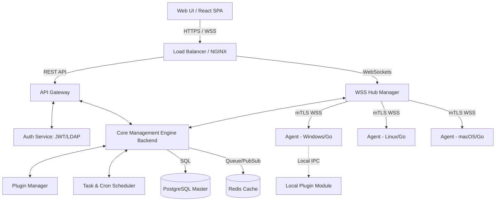
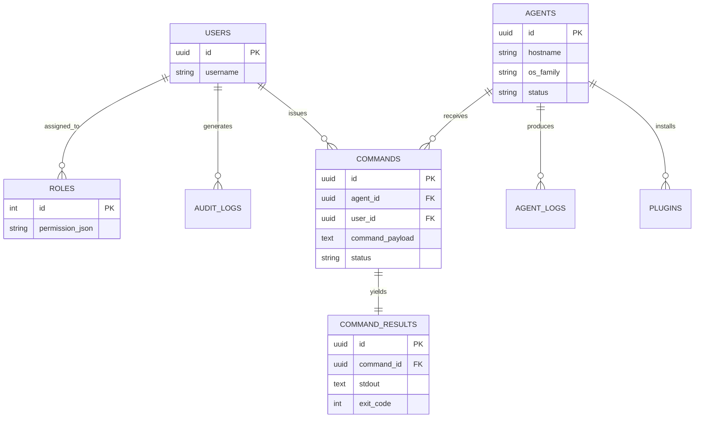
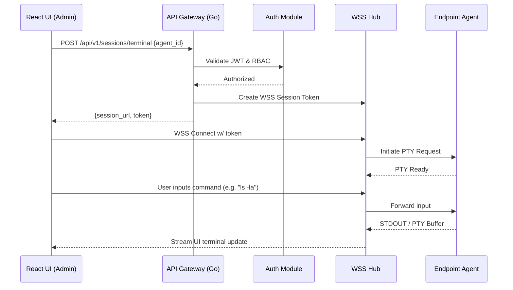

# Enterprise Remote Administration Tool (RAT) Specification

## Executive Summary
This document details the architectural design and implementation strategy for a next-generation Enterprise Remote Administration Tool (RAT) tailored for IT management. Designed with security, scalability, and extensibility as primary goals, the platform enables real-time monitoring and management of thousands of disparate endpoints. Utilizing a robust stack (Go, PostgreSQL, React), the system guarantees high-performance command execution, secure session management, and a seamless administrative experience.

## 1. High-Level Architecture

### Technology Stack Choices
* **Core Engine & Networking Layer (Go):** Selected for its extreme concurrency model (goroutines) capable of handling thousands of simultaneous WebSocket connections with minimal memory overhead. The ability to compile to static binaries makes agent deployment seamless across Windows, macOS, and Linux without requiring runtime dependencies.
* **Persistence Layer (PostgreSQL):** Chosen for robust relational data integrity, ACID compliance, and JSONB support for dynamic plugin metadata. It efficiently handles complex queries for audit logging and hierarchical agent grouping.
* **UI Layer (React/TypeScript):** Modern component-based architecture ensures a highly responsive, real-time dashboard. TypeScript provides crucial type safety, especially when interfacing with complex API responses and WebSocket data streams.
* **In-Memory Cache & Message Broker (Redis):** Acts as a high-speed command queue and publish-subscribe (Pub/Sub) backplane, allowing horizontal scaling of the Go API servers.

### Overall System Diagram

*(Diagram 1: Overall System Architecture)*

## 2. Core Modules & APIs

### Session Management
* **Authentication:** Pluggable authentication supporting local database accounts, OAuth2 providers, and corporate Active Directory/LDAP via secure connectors. Uses short-lived JWTs paired with securely stored HTTP-only refresh tokens.
* **Role-Based Access Control (RBAC):** Extensible permissions model. Administrators can define custom roles with granular policies (e.g., `agent:read`, `command:execute`, `plugin:deploy`) scoped to specific workstation groups.
* **Token Handling:** Stateless API requests use the `Authorization` header (Bearer pattern). WSS handshakes utilize initial ticket-based authentication upgraded to a persistent authenticated connection.

### Command Execution Engine
* **Remote Command Queue:** Commands dispatched from the UI are written to endpoint-specific task queues in Redis. The WSS Hub manager picks up tasks and streams them to the respective connected agent.
* **Task Scheduler:** Background Go workers utilize distributed cron mechanisms (e.g., asynq) to run recurring maintenance jobs (patch scanning, log rotation) across targeted fleets.
* **Result Collector:** Agents execute payloads locally and stream STDOUT/STDERR incrementally back to the server. The WSS Hub aggregates this and broadcasts updates to the React UI, while persisting the final exit code to PostgreSQL.

### Plugin System
* **Extensibility:** The Core Engine supports uploading compiled plugin binaries or scripts. 
* **Distribution:** Selected agents securely download and verify the signature of assigned plugins before execution.
* **Execution:** Plugins run in isolated child processes on the endpoint, communicating with the main agent via local gRPC or standard I/O (JSON).

## 3. Database Schema

### Entity-Relationship Diagram

*(Diagram 2: Core Entity-Relationship Model)*

### SQL DDL (PostgreSQL)

```sql
-- Create extension for UUID generation
CREATE EXTENSION IF NOT EXISTS "uuid-ossp";

-- Users and Authentication
CREATE TABLE users (
    id UUID PRIMARY KEY DEFAULT uuid_generate_v4(),
    username VARCHAR(100) UNIQUE NOT NULL,
    password_hash VARCHAR(255) NOT NULL,
    role VARCHAR(50) DEFAULT 'viewer',
    is_active BOOLEAN DEFAULT TRUE,
    created_at TIMESTAMP WITH TIME ZONE DEFAULT CURRENT_TIMESTAMP
);

-- Endpoints/Agents Inventory
CREATE TABLE agents (
    id UUID PRIMARY KEY DEFAULT uuid_generate_v4(),
    hostname VARCHAR(255) NOT NULL,
    ip_address INET,
    os_family VARCHAR(50),
    os_version VARCHAR(100),
    agent_version VARCHAR(50),
    last_seen TIMESTAMP WITH TIME ZONE,
    status VARCHAR(50) DEFAULT 'offline'
);

-- Command Queuing and Dispatch
CREATE TABLE commands (
    id UUID PRIMARY KEY DEFAULT uuid_generate_v4(),
    agent_id UUID NOT NULL REFERENCES agents(id) ON DELETE CASCADE,
    user_id UUID NOT NULL REFERENCES users(id),
    command_payload TEXT NOT NULL,
    status VARCHAR(50) DEFAULT 'queued', -- queued, running, completed, failed
    created_at TIMESTAMP WITH TIME ZONE DEFAULT CURRENT_TIMESTAMP
);

-- Command Outputs
CREATE TABLE command_results (
    id UUID PRIMARY KEY DEFAULT uuid_generate_v4(),
    command_id UUID UNIQUE NOT NULL REFERENCES commands(id) ON DELETE CASCADE,
    stdout TEXT,
    stderr TEXT,
    exit_code INTEGER,
    completed_at TIMESTAMP WITH TIME ZONE DEFAULT CURRENT_TIMESTAMP
);

-- Indexing Strategy
CREATE INDEX idx_agents_status ON agents(status);
CREATE INDEX idx_commands_agent_status ON commands(agent_id, status);
CREATE INDEX idx_commands_created_at ON commands(created_at);
```
*(Table 1: Example PostgreSQL Schema with Indexing)*  

*Normalization Notes:* User roles can be expanded into a junction table for many-to-many relationships as complexity grows, but simple varchar roles suffice for the MVP. Commands and Results are separated (1:1 relation) to prevent massive row locks on the `commands` table during rapid status updates.

## 4. User Interface Design

### UI Flow and Wireframes
1. **Authentication Portal:** 
   * A clean, centered login modal supporting standard credentials or SSO/SAML integration (e.g., "Login with Okta"). Uses MFA verification flows immediately post-credential validation.
2. **Main Dashboard:** 
   * **Top KPI Bar:** Metrics cards displaying *Total Endpoints*, *Online M/M*, *Active Alerts*, and *Recent Invocations*.
   * **Data Grid:** A high-performance virtualization table (e.g., AG Grid) rendering thousands of Agents, filterable by OS, Online Status, IP Subnets, and custom tags.
3. **Agent Management Perspective:**
   * Clicking an Agent ID opens a specific drawer detailing hardware telemetry (CPU/RAM usage charts).
   * Tabbed interface for: **File Browser**, **Process List**, **Services**, and **Network Connections**.
4. **Command Console:** 
   * A dark-themed, split-pane view featuring a target selector on the left, and a fully interactive WebGL-accelerated terminal emulator (xterm.js) visualizing real-time WSS command streams.

### Interaction Flow: Remote Shell Session

*(Diagram 3: Interactive Terminal Flow)*

## 5. Security & Performance

### Security Standards
* **Authentication/Authorization:** Uses asymmetric JWT (RS256) signing. Access tokens expire in 15 minutes; refresh tokens are heavily guarded. Integration with Microsoft Active Directory via secure LDAP binds ensures corporate identity centralization.
* **Mutual TLS (mTLS):** Agents and the API gateway authenticate each other using X.509 client certificates generated by an internal PKI. This mitigates spoofed agent connections completely.
* **Payload Encryption:** Commands parameters and output streams are additionally encrypted via AES-GCM at the application layer before network transit, implementing a Zero-Trust architecture even if TLS is inspected by internal corporate firewalls.

### Performance Optimizations
* **TLS Termination:** Handled by NGINX or HAProxy at the edge to dramatically lower CPU utilization on the Go application servers.
* **Database Caching:** Redis is configured natively as an LRU cache to store active agent statuses and frequent identical queries, preventing PostgreSQL CPU spikes during fleet "thundering herd" reconnection events.
* **Load Balancing:** Edge Load Balancers utilize sticky-sessions for standard web APIs, while WSS connections are horizontally scaled. A Redis Pub/Sub backplane ensures that any WSS server can broadcast agent events to any UI client, irrespective of which node they're connected to.

## 6. Deployment Roadmap

### Milestone Plan

| Phase | Duration | Deliverables | Test Strategy |
|---|---|---|---|
| **Sprint 1-2 (Foundation)** | 4 Weeks | Infrastructure as Code, CI/CD setup, DB schemas, baseline Go API. React scaffolding. | Unit test coverage > 80% on Go utilities. Schema validation. |
| **Sprint 3-4 (Network & Agent)** | 4 Weeks | Basic cross-platform Go Agent. WebSockets handshake. Implementing mTLS PKI. | Automated integration testing: spin up mock agents in Docker. |
| **Sprint 5-6 (Execution)** | 4 Weeks | Command dispatch backend. React Command Console (xterm.js). Redis queuing. | E2E Playwright UI tests. Performance load testing (e.g., k6). |
| **Sprint 7-8 (Security/Polish)** | 4 Weeks | RBAC modules. LDAP integration. Audit logging hooks. UI polished styling and charts. | External penetration testing. User acceptance testing (UAT). |
*(Table 2: Estimated Implementation Timeline)*

### CI/CD Pipeline Outline (GitHub Actions)
1. **Pull Request Trigger:**
   * Run `golangci-lint` and `eslint`. 
   * Execute Go unit tests and React component tests (Jest).
2. **Build Matrix Execution:**
   * Cross-compile the Go Agent binaries for `windows/amd64`, `linux/amd64`, and `darwin/arm64`.
   * Bundle the React UI using Vite.
3. **Containerization & Push:**
   * Build Docker images for the Core Server and DB proxies.
   * Push validated images to AWS ECR or an internal Harbor registry.
4. **Continuous Deployment (GitOps):**
   * Update Helm charts with the new image tags.
   * ArgoCD automatically syncs and deploys the new manifests to the staging Kubernetes cluster.

## 7. Documentation & Deliverables

### Included Deliverables
* **README.md:** Quickstart guides for spinning up the dev environment via `docker-compose`.
* **Architecture Docs:** Comprehensive Threat Models (STRIDE) and Network topologies.
* **API Specification:** An exported OpenAPI 3.0 YAML generated via standard Go annotations (`swaggo`).
* **Test Cases:** Documented vulnerability regressions and scale-testing benchmarks.

### Example Code Snippets

**Go: Command Dispatcher via WebSockets**
```go
package manager

import (
    "encoding/json"
    "log"
    "github.com/gorilla/websocket"
)

// CommandPayload defines the structure sent to the Agent.
type CommandPayload struct {
    CommandID  string   `json:"command_id"`
    Executable string   `json:"executable"`
    Args       []string `json:"args"`
}

// DispatchCommand serializes and transmits the payload over an active WSS connection.
func DispatchCommand(conn *websocket.Conn, cmdID, exe string, args []string) error {
    payload := CommandPayload{
        CommandID:  cmdID,
        Executable: exe,
        Args:       args,
    }
    
    msg, err := json.Marshal(payload)
    if err != nil {
        log.Printf("Failed to marshal command %s: %v", cmdID, err)
        return err
    }
    
    // Transmit JSON buffer securely over TLS websocket
    return conn.WriteMessage(websocket.TextMessage, msg)
}
```

**React/TypeScript: Agent Status Component**
```tsx
import React from 'react';

interface AgentStatusProps {
  status: 'online' | 'offline' | 'error';
  lastSeen?: string;
}

/**
 * Renders an endpoint's active status badge with optional last check-in time.
 */
export const AgentStatusBadge: React.FC<AgentStatusProps> = ({ status, lastSeen }) => {
  const statusColors = {
    online: 'bg-green-100 text-green-800 border-green-200',
    offline: 'bg-gray-100 text-gray-800 border-gray-200',
    error: 'bg-red-100 text-red-800 border-red-200'
  };

  return (
    <div className="flex flex-col items-start gap-1">
      <span className={`px-2.5 py-0.5 rounded-full text-xs font-medium border ${statusColors[status]}`}>
        {status.toUpperCase()}
      </span>
      {lastSeen && (
        <span className="text-xs text-gray-500">
          Last Check-in: {new Date(lastSeen).toLocaleTimeString()}
        </span>
      )}
    </div>
  );
};
```
